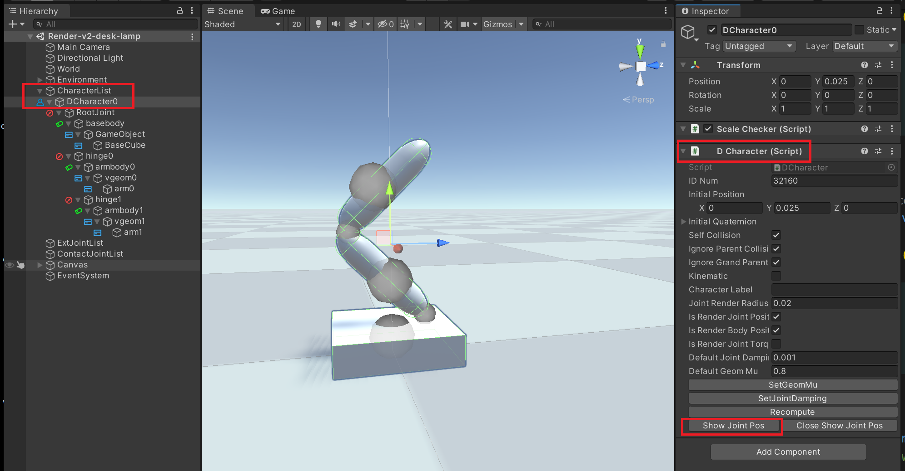
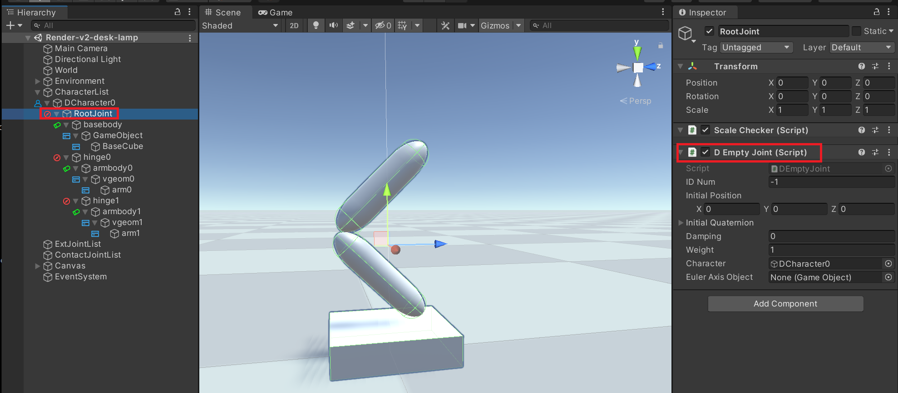
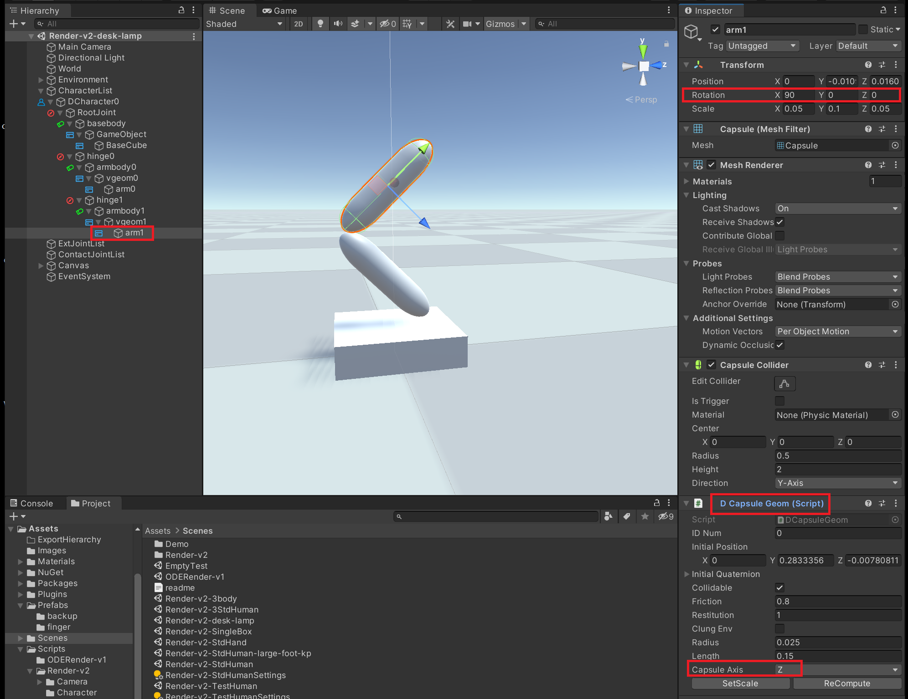
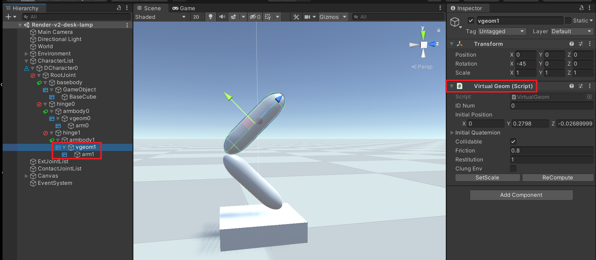

## 在Unity中创建Character

层次结构:

每个Joint的子节点, 应该具有DRigidBody或Joint Component.

每个DRigidBody的子节点, 应该具有VirtualGeom Component.

Character具有DCharacter Component属性, 是CharactersList的子节点.

按照层次结构创建完Character之后, 可以点击右边的Show Joint Pos按钮, 绘制所有Joint和Body的位置. 点击Close Show Joint Pos, 关闭显示Joint和Body位置. 可以通过拖动, 调整Joint和Body的位置. 可以通过旋转, 调整每个Geometry的旋转. 注意: 不要旋转Joint和Body, 保持Joint和Body的旋转都是(0, 0, 0).

为了让整个Character在Unity中旋转, 需要加一个名为`RootJoint`、具有DEmptyJoint Component的虚拟关节. RootJoint的位置应该跟RootBody保持一致.

每个Capsule几何体都需要具有DCapsuleGeom Component. 因为ODE里的Capsule是沿着z轴的(用红框里的Capsule Axis属性标记), Unity里的Capsule是沿着y轴的..为了抵消掉这个差异, 需要把Capsule GameObject的旋转设成(90, 0, 0)..

(我知道这样写很丑, 如果有时间我会重构这一块, 下次一定.jpg)

为了让实际的几何体能够旋转, 每个实际几何体要有带Virtual Geom Component的虚拟几何体

